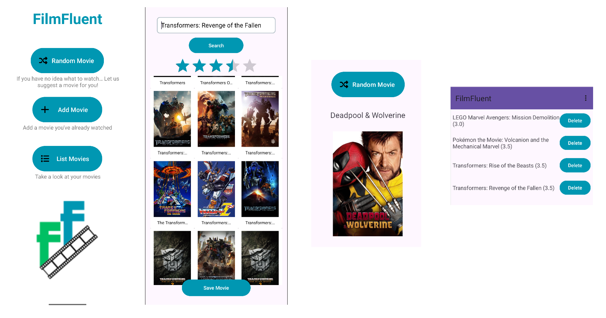

# **FilmFluent**
## **By**
- [Pablo Villarejo Pérez](https://github.com/pablo-villarejo)
- [Antonio Ortega Santaolalla](https://github.com/antonioortegas)

## **Building the Project**
1. **Clone the Repository**:
    ```bash
    git clone https://github.com/pablo-villarejo/FilmFluent.git
    ```
2. **Open the Project in Android Studio**:
    - Open Android Studio.
    - Click on `Open an existing Android Studio project`.
    - Select the `FilmFluent` directory.
    - Wait for the project to load and sync (you will be here a while, trust me. You can maybe go unzip a wordpress project or something, see what finishes first idk, I'm curious).
3. **Add your API KEY**:
    - Create a `local.properties` file in the root directory if it doesn't exist.
    - Add the following line at the end with your API key for [The Movie Database](https://www.themoviedb.org/):
        ```properties
        API_KEY="your_api_key_here"
        ```
4. **Build and Run the Project**:
    - Click on the `Run` button.
    - Select a device or emulator to run the app.



## **Overview**
FilmFluent is an Android app to organize and rate movies you've watched. Developed for the course **Software para Sistemas Empotrados y Dispositivos Móviles**, it runs on Android 14.0 (API Level 34).

## **Features**
- **Random Recommendation**: Get a random movie suggestion.
- **Add Movies**: Add watched movies with star ratings (0.0 to 5.0).
- **View Movie List**: View and sort movies by rating (ascending/descending) or clear filters.

## **Usage**
1. **Get a Recommendation**: Use the random movie feature.
2. **Add a Movie**: Entering a title will show matching movies. Select one, give it a rating, and click 'Save' to add it to your list..
3. **View and Filter**: Open the list to view, sort, or clear filters. You can also delete movies from the list.

## **Course Context**
This app is a project for **Software para Sistemas Empotrados y Dispositivos Móviles**, demonstrating database, UI/UX design, and Android development skills.
